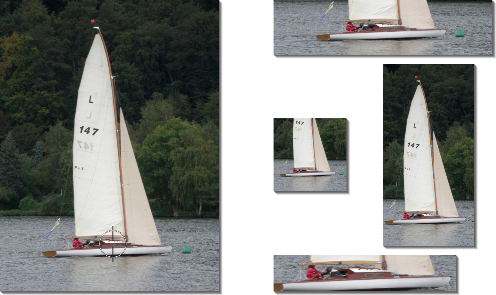

# Focuspoint für REDAXO 5

Das Addon erweitert den Medienpool um die Fähigkeit, den inhaltlichen Mittelpunkt (Fokuspunkt) eines
Bilds zu bestimmen, um es bei der Darstellung auf der Website daran auszurichten.

Die Fokuspunkte können interaktiv im Medienpool festgelegt werden. Die ermittelten Daten werden in
der Medien-Datenbank hinterlegt und können bei der Bildausgabe berücksichtigt werden.

Die Bilder für die Ausgabe werden typischerweise mit Hilfe des REDAXO-Media-Managers erzeugt. Die
nötigen Effekte sind im Addon enthalten.

> Version 2 ist komplett neu geschrieben; Details stehen in der [Änderungsübersicht](docs/changes_2_0.md);
> Speicherung der Daten und Parametrisierung der Media-Manager-Effekte sind geändert. Die Umstellung
> wird bei einem Update automatisch vorgenommen. Es wird dringend geraten, vor dem Update eine
> Datensicherung durchzuführen.

Eine [ausführliche Dokumentation](docs/overview.md) steht auch im Backend zur Verfügung. Sie ist dort
erreichbar über "Hauptmenü / Addons" und dort in der Zeile "focuspoint" mit dem Button "Hilfe".

___

Schreibt doch bitte auftretende Fehler, Notices und Wünsche als Issue auf [Github](https://github.com/FriendsOfREDAXO/focuspoint/issues)

___

Das Changelog findet sich hier: [CHANGELOG.md](CHANGELOG.md)

---

## Lizenz

[The MIT License (MIT)](LICENSE.md)

## Credits

- [FriendsOfREDAXO](https://github.com/FriendsOfREDAXO)
- Idee und Realisierung / Project Lead der ersten Version: [concedra.de / Oliver Kreischer](http://concedra.de)
- Project Lead: [Christoph Böcker](https://github.com/christophboecker)
- Für das Syntax-Highlighting in der Dokumentation:
    - [PrismJS](https://prismjs.com/) und
    - [ClipboardJS](https://clipboardjs.com/)
