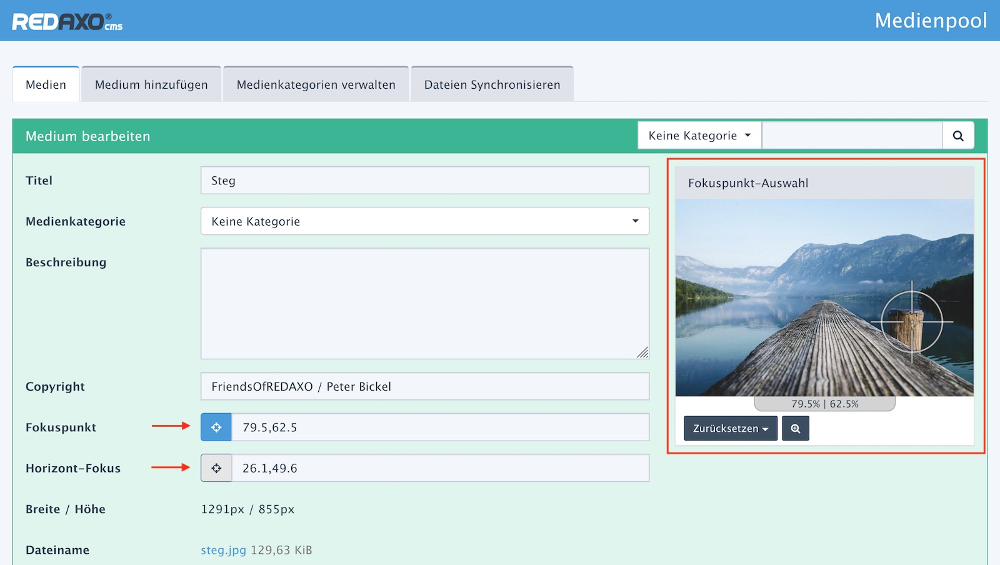

# Fokuspunkte erfassen

Die Koordinaten werden in Metafeldern des Medien-Datensatzes gespeichert. Die Erfassung
erfolgt in der Detailansicht des Medienpools:

Rechts neben dem Eingabereiche wird das Bid angezeigt (roter Rahmen). Im und um das Bild sind
Bedienelemente, mit denen der Fokuspunkt bequem [interaktiv](#media_edit_interactive.md) ausgewählt werden kann.

Die Datenfelder für Fokuspunkte (mit einem roten Pfeil markiert) sind zudem im linken Eingebereich
erreichbar. Hier kann der Fokuspunkt [manuell](media_edit_input.md) eingegeben werden. Beim Verlassen des Feldes wird der
eingegebene Wert in die interaktive Anzeige übernommen.

Die interaktive Auswahl kann immer nur einen Fokuspunkt darstellen bzw. bearbeiten. Der <i class="rex-icon fa-crosshairs"></i>-Button
vor den Eingabefeldern dient zur Auswahl des jeweils aktiven Fokuspunkt-Feldes.  
