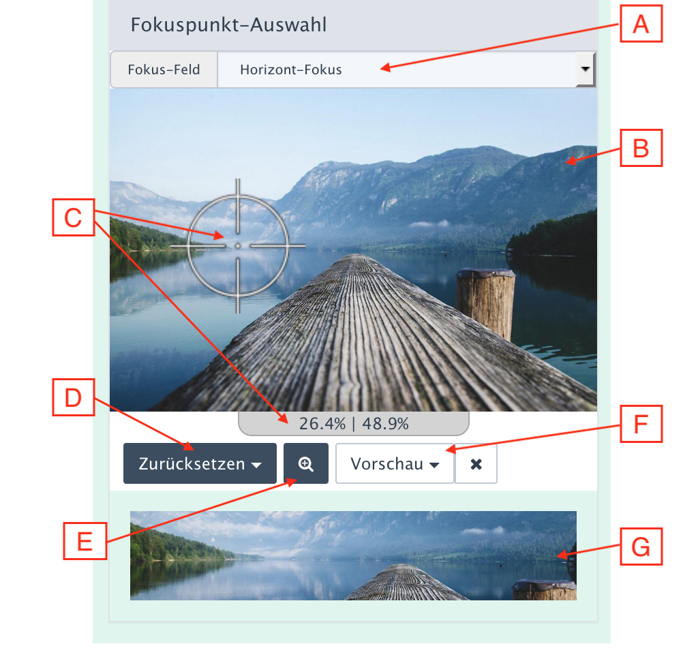

# Interaktive Auswahl

Die Koordinaten werden in Metafeldern des Medien-Datensatzes gespeichert. Die Erfassung
erfolgt in der Detailansicht des Medienpools.

Nachstehend wird die interaktive Auswahl erläutert:

## A - Feldauswahl

Die Kontrollelemente und die Darstellung der interaktiven Auswahl beziehen sich immer nur auf ein Fokuspunkt-Metafeld.
Eine Auswahl ist nur notwendig, wenn es mehr als ein Feld gibt. Sie erfolgt entweder im Formularteil oder über
das Drop-Down-Menü.

Die Auswahl im Formularteil ist der Normalfall.

> Die Auswahl hier im interaktiven Bereich ist nur sichtbar, wenn es mehrere Meta-Felder vom Typ
`Focuspoint (AddOn)` gibt und [mindestens eines der Felder als "hidden" markiert](metafield.md) wurde.

## B - Auswahlbereich

Hier wird das aktuelle Bild angezeigt sowie der aktuelle Fokuspunkt per Fadenkreuz markiert.

## C - Auswahl

Indem der Cursor (als Fadenkreuz) über das Bild verschoben wird, kann ein neuer Fokuspunkt ausgewählt werden.
Die Koordinaten des Cursors werden unter dem Bild laufend angezeigt.

Mit Mausklick wird die Cursorposition zum neuen Fokuspunkt. Das zugehörige Eingabefeld im Formularbereich
wird mitsynchonisiert (falls nicht ausgeblendet).

## D - Zurücksetzen des Fokuspunkt-Feldes

Hier werden als Drop-Down-Menü zwei Varianten des Zurücksetzens angeboten

- **Ausgangswert**: Das ist der (aktuelle) Wert, der beim Aufruf der Detailformulare eingestellt ist, also z.B. ein zuvor gespeicherter Wert.
- **Entfernen**: Setzt das Feld zurück auf den Grundwert (i.d.R. also auf "leer", ggf. auch auf einen Default-Wert gemäß Metafeld-Definition)

Zugleich wird auch das Fadenkreuz zurückgesetzt. Beim **Entfernen** wandert das Fadenkreuz in die Bildmitte.

## E - Zoom

Falls die Darstellung als zu klein für eine zielgerichtete Auswahl empfunden wird, kann per Zoom-Button
die Anzeige vergrößert werden. Nochmaliges Klicken auf den Zoom-Button verkleinert die Darstellung wieder.

"Vergrößern" bedeutet konkret, dass die Seitenspalte auf die Fensterbreite vergrößert wird. Der interaktive Auswahlbereich
wandert so unter die Formularspalte.

> Sollten weitere Inhalte in der Seitenspalte zu finden sein, die nicht dem Fokusoint-AddOn zuzuordnen sind,
> betrifft die Änderung der Anzeige auch sie.

## F - Vorschau

Die Vorschau -Button sind nur dann verfügbar, wenn es für das Fokuspunkt-Feld Typen im  Media-Manager gibt,
die ...

1. Fokuspunkt-Effekte benutzen
2. deren Fokuspunkt-Effekt das aktuelle Fokuspunkt-Metafeld nutzt.

Daher ist die Auswahl i.d.R. deutlich kleiner als die Gesamtliste der Media-Manager-Typen.

Falls keiner der Typen den Kriterien entspricht, sind die Vorschau-Elemente ausgeblendet.

Die Vorschau wird automatisch aktualisiert, sobald ein neuer Fokuspunkt festgelegt ist.

Der <i class="rex-icon rex-icon-package-not-activated"></i>-Button blendet die Vorschau wieder aus.

## G - Vorschaubereich

Die Vorschau zeigt immer nur ein Bild an, dass mit dem ausgewählten Media-Manager-Typen erzeugt wurde.
Das Bild wird in der Originalgröße angezeigt; überscheitet es die Fensterbreite, wird das Bild
passend verkleinert.
