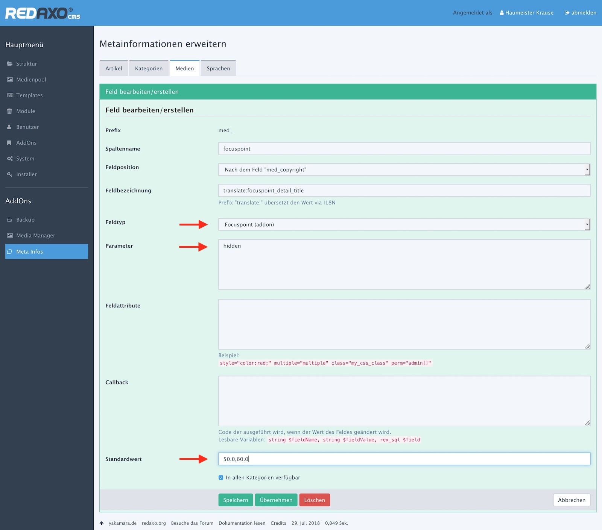

# Datenfelder

**Fokuspunkte** beziehen sich immer auf Bilder. Andere Medien als Bilder werden nicht unterstützt.

Die Fokuspunkte (Koordinaten) werden in **Metafeldern zu Bildern** gespeichert. Eingegeben werden
Koordinaten in Medienpool, genauer gesagt in der Detailansicht eines Bildes.

Ein Metafeld für Fokuspunkte (`med_focuspoint`) wird automatisch mit der Installation bereitgestellt.
Es hat den Datentyp `Focuspoint (AddOn)`.

Es können beliebig weitere Metafelder für Fokuspunkte angelegt werden. Das AddOn erkennt und
berücksichtigt nur Felder, die vom Typ `Focuspoint (AddOn)` sind.

Angelegt und konfiguriert werden Metafelder im Bereich "[Medien](index.php?page=metainfo/media)"
der "Meta-Infos".

{.lupe}

| Parameter | Hinweis |
| - | - |
| Feldtyp | "Focuspoint (AddOn)" auswählen, um Fokuspunktfelder festzulegen. |
| Parameter | Mit dem Text "hidden" wird das Fokuspunktfeld im Medienformular ausgeblendet. Das Feld kann weiterhin interaktiv befüllt werden. |
| Standardwert | Wenn für Medien in diesem Metafeld keine Koordinate erfasst ist, wird statt dessen der hier angegebene Wert herangezogen. Steht hier kein Wert, gilt die Bildmitte |

Der Standardwert wird nicht automatisch für alle Felder herangezogen, er wird nur benutzt, wenn
ein Feld "zurückgesetzt" wird. Besser ist, einen Default-Wert im Effekt des Media-Managers einzustellen.

Es ist empfehlenswert, alle Fokuspunkt-Felder (sofern es mehrere gibt und sie sichtbar sind)
direkt hintereinander zu platzieren.
