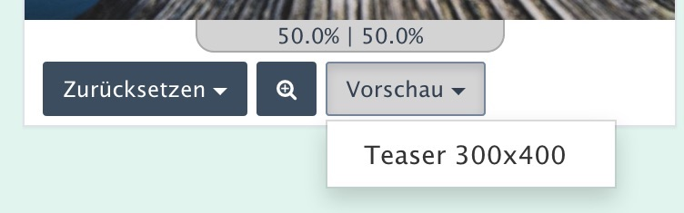

> - [Grundlagen](#overview)
> - [Bildern Fokuspunkte zuweisen](edit.md)
> - [Media-Manager: der Effekt "focuspoint-fit"](media_manager.md)
> - [Addon-Verwaltung](install.md)
> - Hinweise für Entwickler (API)

# Für Entwickler

>
> Neben der beschriebenen Funktionsweise können auf Basis des Focuspoint-AddOn auch eigene
> Anwendungen bzw. Lösungen abseits des vorgesehenen Weges entworfen werden.
>
> Dies sind die wichtigsten Hilfsmittel:
>
> - [Extension-Point `FOCUSPOINT_PREVIEW_SELECT`](#api-ep)
> - [Klasse `FocuspointMedia`](#api-rfm)
> - [Klasse `rex_effect_abstract_focuspoint`](#api-refa)
> - [rex_api_call `focuspoint`](#api-racf)
> - [Eigene Fokuspunkt-Effekte entwickeln](#api-mofe)

Die Klassen sind mit Aussnahme von `rex_api_focuspoint` im Namensraum `FriendsOfRedaxo\Focuspoint\`. Sie
können entweder über einen vollständigen Qualifier aufgerufen werden oder durch Einbinden am Anfang des Scriptes.

```
...
$image = FriendsOfRedaxo\Focuspoint\FocuspointMedia::get($filename);
```

```
use FriendsOfRedaxo\Focuspoint\FocuspointMedia;
...
$image = FocuspointMedia::get($filename);
```


<a name="api-ep"></a>
## Extension-Point **FOCUSPOINT_PREVIEW_SELECT**

Die Focuspunkt-Erfassung zu einem Bild im Mediapool beinhaltet eine Vorschaufunktion für jeweils einen
Media-Manager-Typen. Im Auswahl-Dropdown-Feld werden die Namen der Media-Manager-Typen angegeben,
die für einen Redakteur u.U. nicht hinreichend aussagefähig sind.

Über den Extension-Point `FOCUSPOINT_PREVIEW_SELECT` kann der Text frei bestimmt werden.



Der EP erhält als Parameter ( `$ep->getParams()` ) Informationen zum Bild sowie zu den in Benutzung
befindlichen Typen und Effekten. Es werden alle Media-Manager-Effekte herangezogen, die auf der
Klasse `rex_effect_abstract_focuspoint` beruhen.

Als Subject ( `$ep->getSubject()` ) wird ein Array mit Daten je relevantem Media-Manager-Typ
bereitgestellt, das zu ändern und zurückzugeben wäre:


```php
[ '«media-manager-type-name»' ] =>
    [
        'label'=>'«media-manager-type-name»',
        'meta'=> [‘«meta-info-focuspoint-field»’,...]
    ],
...
```

Hier ein Anwendungsbeispiel, bei dem als Label die `description` des Media-Manager-Typs den `name`
ersetzt:
```php
rex_extension::register('FOCUSPOINT_PREVIEW_SELECT', function($ep){
    $mediatypes = $ep->getSubject();
    foreach( $ep->getParams()['effectsInUse'] as $eiu ) {
        if( $eiu['description'] && isset( $mediatypes[$eiu['name']] ) ) {
            $mediatypes[$eiu['name']]['label'] = $eiu['description'];
        }
    }
    uasort( $mediatypes, function($a,$b){ return strcasecmp($a['label'],$b['label']); } );
    return $mediatypes;
});
```

In folgenden Beispiel wird ein Element aus der Liste entfernt. Das kann z.B. notwendig sein, wenn der
Media-Manager-Typ zwar einen Focuspoint-Effekt nutzt, das Bild aber nicht aus dem Medienpool zieht.
Da dieser Umstand nicht hinreichend zuverlässig automatisch erkennbar ist, muss der Media-Manager-Typ
über den EP entfernt werden:
```php
rex_extension::register('FOCUSPOINT_PREVIEW_SELECT', function($ep){
    $mediatypes = $ep->getSubject();
    if( isset($mediatypes['xyz']) ) {
        unset($mediatypes['xyz']);
    }
    return $mediatypes;
});
```

> **Hinweis:**  
>
> Die Daten im Array `mediatypes` bzw. `$ep->getSubject()` sind auch zur Steuerung der Zusammenspiels
> zwischen den Metafeldern und der interaktiven Fokuspunkt-Auswahl. Veränderungen über Label hinaus
> sollten mit Vorsicht angegangen werden!


<a name="api-rfm"></a>
## Klasse `FocuspointMedia`

Die neue Klasse `FocuspointMedia` erleichtert die Nutzung von Medien mit Fokuspunkt-Datenfeldern.

Konkret stellt die Klasse zwei zusätzliche Methoden bereit:

- `hasFocus`    prüft ab, ob das Fokuspunkt-Metafeld belegt ist oder nicht
- `getFocus`    liefert ein gültiges Fokuspunkt-Koordinatenpaar als Array

### hasFocus()

```php
bool function hasFocus( string $metafield = null )
```

Die Funktion liefert `true` zurück, wenn das als Parameter angegebene Metafeld existiert und eine
formal gültige Koordinate enthält. In allen anderen Fällen wird `false` zurückgemeldet.

Hier ein Anwendungsbeispiel, bei dem der gesetzte Fokuspunkt bereits in der Kategorieübersicht
(Liste der Medien) des Medienpools angezeigt wird. An geeigneter Stelle, z.B. in der `boot.php`
eines Addons wird der Extension-Point `MEDIA_LIST_FUNCTIONS` belegt.
Abgefragt wird das Default-Feld "med_focuspoint":

```php
use FriendsOfRedaxo\Focuspoint\FocuspointMedia;

if( rex_request('page', 'string') == 'mediapool/media' && !rex_request('file_id', 'string') )
{
    rex_extension::register( 'MEDIA_LIST_FUNCTIONS', function( rex_extension_point $ep )
    {
        $image = FocuspointMedia::get( $ep->getParams()['file_name'] );
        if( $image && $image->hasValue() )
        {
            list( $x, $y) = $image->getFocus();
            return $ep->getSubject() ."<div class=\"text-left\">FP: $x%, $y%</div>";
        }
    });    
}
```

Falls zusätzlich individuelle Fokuspunkt-Metafelder definiert sind, kann mit dieser Variante der
komplette Satz überprüft werden:

```php
use FriendsOfRedaxo\Focuspoint\Focuspoint;
use FriendsOfRedaxo\Focuspoint\FocuspointMedia;

if( rex_request('page', 'string') == 'mediapool/media' && !rex_request('file_id', 'string') )
{
    rex_extension::register( 'MEDIA_LIST_FUNCTIONS', function( rex_extension_point $ep )
    {
        $image = FocuspointMedia::get( $ep->getParams()['file_name'] );
        if( $image )
        {
            $content = [];
            foreach( Focuspoint::getMetafieldList() as $fpFeld )
            {
                if( $image->hasFocus(fpFeld) )
                {
                    list( $x, $y) = $image->getFocus(fpFeld);
                    $content[] = "$fpFeld: $x%, $y%";
                }
            }
            if($content) return $ep->getSubject() .'<div class="text-left">'.implode( '<br>',$content ).'</div>';
        }
    });    
}
```

### getFocus()

```php
array function getFocus( string $metafield = null, array $default = null, $wh=false )
```

Die Parameter sind:

- Name des heranzuziehenden Fokuspunkt-Metafeldes. Vorgabe: `med_focuspoint`.
- Fallback-Wert, falls das Feld leer ist ([x,y]). Vorgabe: `[50,50]`.
- `true` zur Umrechnung der relativen in absolute Koordinaten auf Basis der Bildgröße. Vorgabe: `false`. Man kann statt `true` auch eine eigene Bildgröße als Array `[«breite»,«höhe»]` angeben.

Falls das angegebene Fokuspunkt-Metafeld nicht existiert, wird nicht auf das Default-Feld
zurückgegriffen, sondern der Fallback-Wert herangezogen.

Die Klasse `FocuspointMedia` kann z.B. in eigenen Effekten, die auf Fokuspunkten basieren,
eingesetzt werden, aber auch in beliebigen anderen Zusammenhängen. Hier ein Beispiel :
```php
use FriendsOfRedaxo\Focuspoint\FocuspointMedia;

$fpMedia = FocuspointMedia::get( $filename );

if ( $fpMedia )
{
    list( $fx,$fy ) = fpMedia->getFocus( 'med_focuspoint_face', [50,60], true );

    ....

}
```

Im Beispiel wird versucht, für das Metafeld `med_focuspoint_face` die Koordinaten abzurufen. Sollte der Abruf
kein [formal gültiges Koordinatenpaar](overlay.md#coordinate) liefern, wird statt dessen der Fokuspunkt auf `[50,60]`
gesetzt. `true` bewirkt, dass der Rückgabewert in absolute Bildpunkte umgerechnet wird.
Ein Bild mit den Abmessungen `1291px / 855px` ergibt auf Basis des Fallback-Wertes die Rückgabe
`[646,513]`.

> `FocuspointMedia::get( $filename )` liefert nur dann ein Objekt zurück, wenn die angegebene
> Datei ein Bild ist, sonst `null`.


<a name="api-refa"></a>
## Klasse `rex_effect_abstract_focuspoint`

Wie der Name schon nahelegt, ist die Klasse eine Erweiterung der Klasse `rex_effect_abstract` für Fokuspunkt-Effekte.

> **Bitte beachten:** eigene Fokuspunkt-basierte Effekte sollten immer von der Klasse `rex_effect_abstract_focuspoint`
abgeleitet werden. Das AddOn basiert darauf, dass Fokuspunkt-Effekte von der Klasse
`rex_effect_abstract_focuspoint` abstammen und die darin bereitgestellten Parameter-Felder
(`meta`, `focus`) aufweisen.

> **Bitte beachten:** Mediamanager-Effekte werden READXO-intern über den Klassennamen `rex_effect_....` gesucht.
Effekte dürfen nicht in einem Namespace wie `FriendsOfRedaxo\Focuspoint` liegen. 

Es stehen sechs Methoden zur Verfügung:

- `str2fp` wandelt einen Koordinaten-String in ein Koordinaten-Wertepaar um oder liefert false
- `rel2px` wandelt ein Koordinaten-Wertepaar in absolute Bildkoordinaten (Pixel) um
- `getDefaultFocus` ermittelt den Fallback-Wert, falls ein Meta-Feld nicht belegt ist.
- `getMetaField` ermittelt das anzuwendende Fokuspunkt-Metafeld
- `getFocus` liefert den anzuwendenden Fokuspunkt für diesen Effekt.
- `getParams` erstellt die beiden ersten Felder für das Effekt-Konfigurations-Formular:
    - welches Fokuspunkt-Metafeld wird herangezogen (`meta`)
    - Fallback-Fokuspunkt für diesen Effekt (`focus`)

Die Methoden `str2fp` und `rel2px` sind statisch deklariert.


### str2fp()

```php
mixed function str2fp( string $xy, array $wh=null )
```

Der angegebene Text `$xy` wird in ein Array mit einer gültigen Fokuspunkt-Koordinate umgewandelt.
Die Überprüfung und Aufschlüsselung erfolgt mittels eines Regulären Ausdrucks. Ist der Text formal
ungültig, wird false zurückgegeben.

Falls `$wh` angegeben ist, erfolgt die Umrechnung und Rückgabe in absoluten Bildwerten. `$wh` muss
ein Array sein mit zwei Zahlen: `$wh = [ 0 => «bildbreite», 1 => «bildhöhe» ];`

Die Funktion ist "static" deklariert und kann auch außerhalb des Klassen-Kontext aufgerufen werden.

```php
$fp1 = rex_effect_abstract_focuspoint::str2fp( '50,60');                 // Ergebnis: false
$fp1 = rex_effect_abstract_focuspoint::str2fp( '50.0,60.0');             // Ergebnis: [50,60]

$fp1 = rex_effect_abstract_focuspoint::str2fp( '50,60',[1291,855]);      // Ergebnis: false
$fp1 = rex_effect_abstract_focuspoint::str2fp( '50.0,60.0',[1291,855]);  // Ergebnis: [646,513]
```


### rel2px()

```php
array function rel2px( array $xy, array $wh )
```

Die Funktion wandelt die relativen Koordinaten (`$xy`) in absolute Bildkoordinaten um. Das Array `$wh`
enthält die Breite bzw. Höhe.

Die Funktion ist "static" deklariert und kann auch außerhalb des Klassen-Kontext aufgerufen werden.

```php
$fp = rex_effect_abstract_focuspoint::rel2px( [50,60], [1291,855] );     // Ergebnis: [646,513]
```


### getDefaultFocus()

```php
array function getDefaultFocus( array $default=null, array $wh=null )
```

`getDefaultFocus` ermittelt den Fallback-Wert für den Fokuspunkt. Zunächst wird der Wert des Feldes
'Koordinate (default)' in der Fokus-Parametrisierung ausgewertet. Ist er ungültig
oder leer wird der angegebene `$default` ohne weitere Prüfung übernommen. Ist
`$default` nicht angegeben, wird die Bildmitte genommen (50,50).

Falls `$wh` angegeben ist, erfolgt die Umrechnung und Rückgabe in absoluten Bildwerten.

```php
// rex_effect_«effektname»_focus = '50.0,60.0'

$fp1 = $this->getDefaultFocus(  );                    // Ergebnis: [50,60]
$fp1 = $this->getDefaultFocus( [50,65] );             // Ergebnis: [50,60]
$fp1 = $this->getDefaultFocus( [50,65],[1291,855] );  // Ergebnis: [646,513]

// rex_effect_«effektname»_focus = ''

$fp1 = $this->getDefaultFocus(  );                    // Ergebnis: [50,50]
$fp1 = $this->getDefaultFocus( [50,65] );             // Ergebnis: [50,65]
$fp1 = $this->getDefaultFocus( [50,65],[1291,855] );  // Ergebnis: [646,556]
```

### getMetaField()

```php
string function getMetaField()
```

Die Funktion ermittelt das für den Effekt heranzuziehende Metafeld im Medienpool. Dabei wird nicht überprüft,
ob das Feld tatsächlich (noch) existiert. Sofern in der Effekt-Parametrisierung statt auf ein Metafeld
auf den Fallback-Wert verwiesen wird (`default`), wird ein leerer String zurückgeliefert.

```php
// rex_effect_«effektname»_meta = 'default'

$x = $this->getMetaField(  );                     // Ergebnis: ''

// rex_effect_«effektname»_meta = 'med_focuspoint'

$x = $this->getMetaField(  );                     // Ergebnis: 'med_focuspoint'
```

### getFocus()

```php
array function getFocus( FocuspointMedia $media=null, array $default=null, array $wh=null )
```

Die Funktion ermittelt den für das Bild relevanten Fokuspunkt. Dabei werden unterschiedliche Quellen in folgender Reihenfolge herangezogen:
1. Falls in der URL der Parameter xy=«koordinate» enthalten ist, wird der angegebene Wert genutzt. Zum Einsatz kommt
	dieser Mechanismus bei den Fokuspunkt-Vorschaubildern im Medienpool. Falls der URL-Parameter keine gültige Koordinate ist,
	greift Variante 2.
2. Falls in der URL der Parameter xy=«metafeld» enthalten ist, wird statt des in der Effekt-Konfiguration ausgewählten
	Focuspoint-Metafeldes das hier angegebene Feld benutzt. Für $media gelten die Regeln aus Punkt 3.
3. Wenn $media ein Objekt vom Typ FocuspointMedia (oder davon abgeleitet) ist, wird darüber der Fokuspunkt  
	direkt aus den Bilddaten im Medienpool abgerufen. Basis ist das in der Effekt-Konfiguration ausgewählte Metafeld.
4. Wenn die obigen Varianten auf einen Fehler laufen bzw. keine Daten finden, wird `$default` zurückgegeben.
5. Wenn `$default` nicht angegeben ist, wird `[50,50]` zurückgegeben (also Bildmitte).


```php
$focuspoint = $this->getFocus( FocuspointMedia::get( $this->media->getMediaFilename() ), [ 50,60 ] );
...
```

### getParams()

```php
array function getParams()
```

Die Methode liefert für den Parametrisierungsdialog eines Fokuspunkt-Effektes das
Grundgerüst mit zwei Feldern:

- Auswahl des heranzuziehenden Metafeldes (`meta`)
- Default-Koordinate (`focus`)

Eigene, weitergehende Parameter-Felder könne per `array_merge` hinzugefügt werden:

```php
public function getParams()
{
    return array_merge( parent::getParams(),
        [
            [
                'label' => 'Mein Parameter'),
                'name' => 'mein_parameter',
                'type' => 'int',
            ],
        ]);
}
```

<a name="api-racf"></a>
## rex_api_call "focuspoint"

Focuspoint erweitert das Media-Manager-AddOn. Bilder werden durch den Media-Manager erzeugt - nach
_dessen_ Regeln. Der Media-Manager cached einmal erstellte Bilder. Damit in der [Vorschau](edit.md#preview)
auch das jeweilige Bild als "temporäre" Version angezeigt werden kann, ist ein Trick notwendig.
Das Bild wird nicht auf regulärem Weg abgerufen, sondern über einen rex-api-call, der die
temporäre Datei des Media-Managers löscht und so den Neuaufbau des Bildes mit den temporären Koordinaten erzwingt.

Die Methode kann auch gezielt in anderen Zusammenhängen eingesetzt werden.

> **Bitte beachten:** Das System an sich wird gebremst, da die Bilder nicht mehr gecached sind, sondern
immer neu generiert werden.  

Der Vollständigkeit halber ist hier der Aufbau der URL:

```html
index.php?page=structure&file=«mediafilname»&type=«mediamanagertype»&xy=«koordinaten»
```

Der angegebene Media-Manager-Type wird wie üblich verarbeitet und das Bild erstellt. Dabei beziehen
die Fokuspunkt-Effekte ihre Koordinaten nicht aus dem Meta-Feld, sondern aus dem Parameter xy der URL.

Der Parameter xy muss dem üblichen Aufbau für Koordinaten entsprechen und wird - wenn nicht - durch den Default-Wert ersetzt.

> **Bitte beachten:** eigene Fokuspunkt-basierte Effekte sollten immer von der Klasse
`rex_effect_abstract_focuspoint` abgeleitet werden und die Methode `getFocus` nutzen, da so die
Auswertung des xy-Parameters sichergestellt wird. Nur dann wird das Vorschaubild
korrekt angezeigt.

<a name="api-mofe"></a>
## Eigene Fokuspunkt-Effekte entwickeln

Effekte für den Media-Manager basieren auf der Klasse `rex_effect_abstract`.
Fokuspunkt-basierte Effekte sollten auf der Klasse `rex_effect_abstract_focuspoint` aufsetzen.

Eine neue Effekt-Klasse sollte drei Methoden bereitstellen:

- `getName` liefert den Namen des Effektes z.B. für Auswahllisten
- `getParams` erzeugt die Parameter-Felder für die Effekt-Konfiguration im Media-Manager
- `execute` generiert das neue Bild unter Anwendung des Effektes.

Eine rudimentäre Effekt-Klasse würde so aussehen:

```php
use FriendsOfRedaxo\Focuspoint\rex_effect_abstract_focuspoint;

class rex_effect_focuspoint_myeffect extends rex_effect_abstract_focuspoint
{
    function getName()
    {
        return 'Mein Fokuspunkt-Effekt';
    }

    function execute()
    {

		$focuspoint = $this->getFocus( FocuspointMedia::get( $this->media->getMediaFilename() ) );

		$this->media->asImage();
		$gdimage = $this->media->getImage();

		- - -
			Bildbearbeitung: Parameter berechnen
		- - -

		if (function_exists('ImageCreateTrueColor')) {
			$des = @imagecreatetruecolor( «zielbreite», «zielhöhe» );
		} else {
			$des = @imagecreate( «zielbreite», «zielhöhe» );
		}

		if (!$des) {
			return;
		}

		$this->keepTransparent($des);

		- - -
			Bildbearbeitung: Zielbild in $des erstellen
		- - -

		$this->media->setImage($des);
		$this->media->refreshImageDimensions();
    }

    public function getParams()
    {
        return array_merge( parent::getParams(),
            [
                [
                    'label' => 'Mein Parameter'),
                    'name' => 'mein_parameter',
                    'type' => 'int',
                ],
            ]);
    }

}
```
