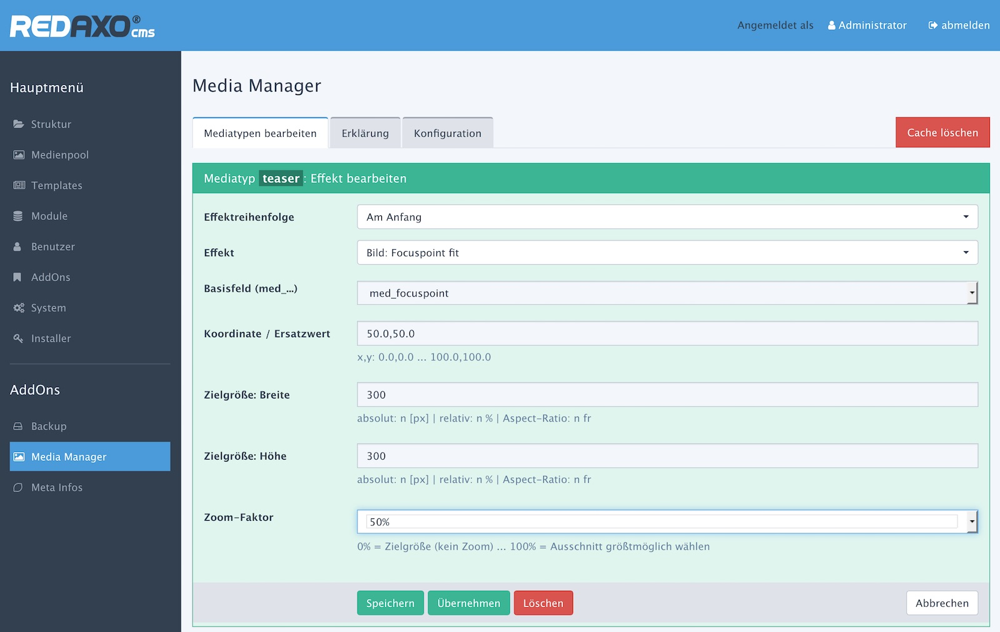
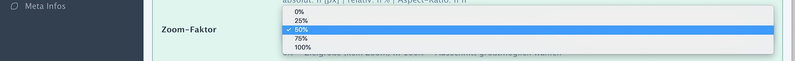
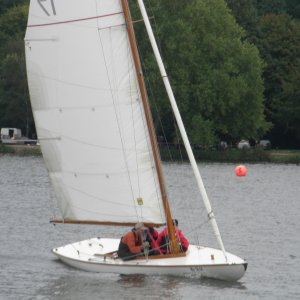
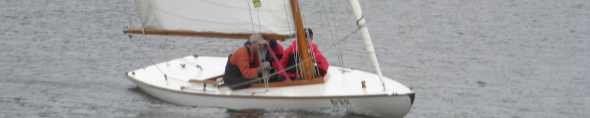
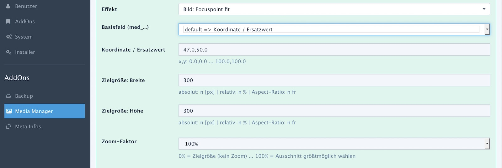

> - [Grundlagen](#overview)
> - [Bildern Fokuspunkte zuweisen](edit.md)
> - Media-Manager: der Effekt "focuspoint-fit"
> - [Addon-Verwaltung](install.md)
> - [Hinweise für Entwickler (API)](developer.md)

# Focuspoint-Fit konfigurieren

> - [Übersicht](#a)
> - [Den Effekt konfigurieren](#b)
> - [Das Zielformat festlegen: Breite und Höhe](#c)
> - [Zoom bzw. Ausschnitte](#d)
> - [Typische Anwendungen](#e)

## Übersicht

Der Effekt **Fokuspoint-Fit** erzeugt aus heterogenem Quellmaterial, also Bildern mit stark unterschiedlichen Größen und Formaten)
stets Zielbilder in verlässlicher Größe. Der Fokuspunkt dient als Orientierung für Zuschnitt und Skalierung.

Der Preis dafür: Teile des Quellbildes müssen abgeschnitten werden, wenn die Seitenverhältnisse von Quell- und Zielformat
(Aspect-Ratio, AR) nicht übereinstimmen, denn das Zielformat hat **immer** Vorrang.

Der Fit-Effekt ist somit eine intelligente Mischung aus Resize und Crop mit den Vorteilen

- verlässliches Ziel-Format, also kein zerschossenes Layout
- geringer Qualitätsverlust, da nur eine Bildumwandlung nötig ist

Wie das funktioniert zeigt ein [ausführliches Beispiel](media_manager_calc.md).

Fokuspunkt-orientierte Bilder sollten über den Media-Manager und entsprechende Effekte erzeugt werden.
Erstens wird der Client von Bildoperationen auf JS-Basis entlastet und zweitens sind die Bilder
gecached.

Dabei ist unbedingt zu beachten:

- Fokuspunkt-basierte Effekte setzen voraus, dass das Seitenverhältnis (Aspect-Ratio) des Originalbildes vorliegt.
- Ein "Resize" ohne Änderung des Seitenverhältnisses ist unkritisch, denn die Fokuspunkt-Koordinaten sind ein Prozentsatz der Bildabmessungen.
- Die Reihenfolge mit Bildeffekten (blur, sharpen, etc.), die bezogen auf das Seitenverhältnis keine Änderung durchführen, ist unkritisch
- Formatneutrale Fokuspunkt-Effekte müssen vor (einem) formatverändernden Effekt ausgeführt werden.
- Nicht jeder Grafiktyp wird vom Media-Manager klaglos verarbeitet. SVG ist z.B. nicht unterstützt.

Media-Manager-Typen, die Effekte auf Basis der Klasse `rex_effect_abstract_focuspoint` aufweisen (z.B. 'focuspoint_fit'), können in der
interaktiven [Fokuspunkt-Festlegung](edit.md#f-vorschau) in der Vorschau genutzt werden.

## Den Effekt konfigurieren

Mit wenigen Parametern lässt sich der Effekt flexibel konfigurieren:

| Parameter | Hinweis |
| - | - |
| Basisfeld | Legt fest, aus welchem Medien-Metafeld des Typs "Fokuspoint (AddOn)" die Koordinate herangezogen wird. Alternativ kann der [Ersatzwert](#pass) als alleinige Koordinatenquelle genutzt werden (feste Koordinate für alle Bilder). |
| Koordinate Ersatzwert | Dieser Wert wird als Koordinate benutzt, wenn das zuvor ausgewählte Metafeld des Bildes leer ist.  |
| [Zielgröße](#c) | Breite und Höhe des Zielbildes |
| [Zoom-Faktor](#d) | Über den Zoom-Faktor wird festgelegt, wie groß der Ausschnitt aus dem Quellbild ist. |

## Das Zielformat festlegen: Breite und Höhe

Focuspoint-Fit soll Bilder in verlässlicher Größe erzeugen. Dazu müssen Breite und Höhe des
Zielbildes bekannt sein. Als Größenangaben sind auch variable Werte möglich. In dem Fall wird
die Zielformatgröße aus Abmessungen des Originalbildes abgeleitet.

Was in welcher Kombination passiert zeigt die nachfolgende Tabelle. Die Beispielberechnungen beruhen
auf einem Originalbild der Abmessungen 1600x1200 (AR 4:3, quer) bzw. 1200x1600 (AR 3:4, hoch). Das angestrebte Zielformat ist 300x300.

| Typ | Breite | Höhe | Erklärung | Zielformat *(Quelle: quer)* | Zielformat *(Quelle: hoch)* |
| --- | --- | --- | --- | --- | --- |
| 1 | 300 | 300 | Normalfall wie oben beschrieben | 300 x 300 | 300 x 300 |
| 2a | 300 | | Höhe wird über den AR des Bildes ermittelt | 300 x 225 | 300 x 400 |
| 2b | | 300 | Breite wird über den AR des Bildes ermittelt | 400 x 300 | 225 x 300 |
| 3a | 300 | 20% | Höhe ist 20% der Höhe des Originalbildes | 300 x 240 | 300 x 320 |
| 3b | 20% | 300 | Breite ist 20% der Breite des Originalbildes | 320 x 300 | 240 x 300 |
| 4a | 20% | | Breite ist 20% der Breite des Originalbildes Höhe wird über den AR des Bildes ermittelt (wirkt also wie "20%, 20%") | 320 x 240 | 240 x 320 |
| 4b | | 20% | Höhe ist 20% der Höhe des Originalbildes Breite wird über den AR des Bildes ermittelt (wirkt also wie "20%, 20%") | 320 x 240 | 240 x 320 |
| 5 | 40% | 20% | Höhe und Breite sind jeweils x% der Abmessung des Originalbildes | 640 x 240 | 480 x 320 |
| 6 | 16fr | 9fr | Kappt das Bild in das Format 16:9 | 1600 x 900 | 1200 x 675 |

### Bilder fester Größe (1)

Nur in Variante 1 wird die angestrebte verlässliche Zielgröße erzeugt. Dies ist auch der Hauptanwendungszweck für Focuspoint-Fit.

### Bild im vorgegebenen Format/Aspect-Ratio (6)

Hiermit wird ein Bild mit einem fest vorgegebenen Aspect-Ratio erzeugt.
Mangels Angabe einer Zielgröße (dann würde Variante 1 greifen) wird das Bild maximal groß werden.

**Beide** Eingabefelder müssen einen fr-Wert aufweisen. Der voreingestellte Wert des Zoom-Faktors wird ignoriert. Statt
dessen wird intern mit 100% gerechnet, um ein maximal großes Bild zu erzielen.

Dies ist die zweitbeste Variante bezogen auf die angestrebte Zielsetzung, zumindest ein verlässliches Format (AR) zu erzeugen.

### Bilder fester Breite oder Höhe (2,3)

In diesen Varianten ist eine Dimension fest vorgegeben. Bilder fester Breite eignen sich für vertikale Anordnung
direkt untereinander, Bilder fester Höhe für zeilenweise Anordnung nebeneinander.

### Ausschnitte (4,5)

Die Größen werden in Prozent der Originaldimension angegeben. Ansonsten funktioniert es wie Variante 2. Der Ergebnisse sind, sowohl auf die
absolute Größe wie auch die Seitenverhältnisse bezogen, nur schwer vorher abschätzbar, wenn das Ausgangsmaterial sich stark unterscheidet.

In der Variante 4 ist die Zoom-Option 100% sinnlos, da am Ende wieder das Originalbild entstehen würde.

## Zoom bzw. Ausschnitte

Im ersten Schritt wird stets angenommen, dass um den Fokuspunkt ein Ausschnitt in der Zielgröße ausgeschnitten wird.
Über den Zoom-Faktor kann festgelegt werden, wie viel vom Rest des Quellbildes in das Zielbild kommen soll.

Hier ein Beispiel für ein Quellbild der Größe 3072x2304 und einem Zielformat von 300x300. Der Restplatz in der
Engpassdimension (Höhe) ist 2004 px.

| Auswahl | Auswirkung | Beispiel |
| ------- | ---------- | -------- |
| 0% | Es bleibt beim Zielausschnitt | 300x300 |
| 25% | 25% vom Rest wird mit in das Zielbild genommen | 801x801 |
| 50% | 50% vom Rest wird mit in das Zielbild genommen | 1302x1302 |
| 75% | 75% vom Rest wird mit in das Zielbild genommen | 1803x1803 |
| 100% | Der komplette Rest wird mit in das Zielbild genommen | 2304x2304 |

Dazu gibt es eine [bebilderte Beschreibung](media_manager_calc.md) des Berechnungsverfahrens.

> Wenn das Zielbld (ohne Zoom) bereits größer ist als das Quellbild, wird das Original so vergrößert, dass es in das
Zielformat passt (automatische Vergrößerung).

## Typische Anwendungen

### Bilder größtmöglich auf ein Zielformat bringen

Breite und Höhe werden fest vorgegeben und der Zoom-Faktor auf 100% gestellt, um möglichst viel vom Originalbild in das Zielbild zu
überführen. Dank des Fokuspunktes wird dort gekappt wird, wo es am wenigsten weh tut.

Das obige Beispiel mit Zoom = 100% ergibt

### Bilder für Kopfzeilen/Banner erstellen

Die Bilder werden breit, aber nicht hoch mit einem AR von z.B. 4:1 oder 5:1. Zur Umsetzung gibt es zwei Varianten:

- Ein Bild fester Größe erzeugen, indem die Abmessungen vorgegeben und der Zoomfaktor z.B. auf 75% oder 100% gestellt wird.
- Alternativ kann auch nur der Aspect-Ratio angegeben werden. Die Breite wäre z.B. als 4fr und die Höhe als 1fr anzugeben.

### Details herausheben

Das ist ein Anwendungsfall für Zoom-Faktoren unter 100%. Wenn das Zielformat und das Quellformat sehr deutlich voneinander
abweichen, kann ein Zoom-Faktor von 0% problematisch werden, da der Ausschnitt sehr klein wäre.

Sind die Originalbilder nur wenig (na ja, so bis 20%) größer als das Zielformat, bietet sich die oft eh die 0%-Variante an.

### Passbilder

Liegen die Quellbilder in einem verlässlichen Format vor und haben einen sehr ähnlichen Fokuspunkt (z.B. eine Reihe Portrait-Fotos)
kann man auch ohne bildindividuellen Fokuspunkt zum Ziel kommen. Angenommen die "Passbilder" liegen im Format 3:4 vor und sollen
auf 1:1 gekappt werden mit 10% Kappung oben.

Rechenbeispiel? Die Original-Bilder sind in der Größe 900x1200, das Zielformat ist 300x300, der Zoom-Faktor 100%.
Der Bildausschnitt ist also 900x900. Der verbleibende Rest von 300 px
in der Höhe muss gekappt werden. Oben werden 10% des Bildes gekappt = 120px. Der Rest (180px) wird unten gekappt.
Das entspricht einem Fokuspunkt vertikal von 47%; der horizontale ist 50%.

| Original | Ziel |
| :--------: | :----: |
|  |   |

### Gleich breite Bilder für Spalten, bzw. gleich hohe Bilder für Zeilen

Die Bildgröße kann auch relativ angegeben werden. Allerdings sind relative Werte immer bezogen auf das Originalbild. Damit ist
am Ende kein verlässliches Zielformat zu erzeugen. Dennoch kann es tricky sein, diese Variante zu nutzen.

Setze man die Zielbreite fest und gibt keine Zielhöhe an, wird ein Zielbild erzeugt, dass eben genau die Zielbreite
aufweist. Der Aspect-Ratio ergibt sich aus dem AR des Originalbildes. Alle Bilder haben also unabhängig vom Original-AR immer die gleiche Breite. Nur die Höhe variiert.

Analog mit vorgegebener Höhe variiert die Breite; das ist nützlich für Bilder in einer Zeile.
