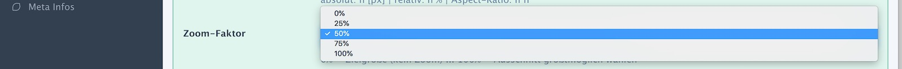

# Wie **Focuspoint-Fit** rechnet

(zurück zu [Focuspoint-Fit konfigurieren](media_manager.md))

> ## Inhalt
>
> - [Den Engpass ermitteln](#efc-engpass)
> - [Den Ausschnitt berechnen](#efc-ausschnitt)
> - [Den Auschnittsrahmen um den Fokuspunkt positionieren](#efc-rahmen)
> - [Zielbild erzeugen](#efc-bild)

Ausgangspunkt ist ein Beispielbild in den Abmessungen 3072x2304 mit einem AR von 1,33 ( 4:3).
Der Fokuspunkt ist gelb
markiert und liegt bei 46% horizontal und 81% vertikal (string: `'46.0,81.0'`, array: `[46,81]`).

Das Beispiel erzeugt quadratische Teaser-Bilder im Format 300x300 mit einem AR von 1:1 (also 1).
Die Einzelheiten werden jetzt Schritt für Schritt erklärt.

Hier die Konfiguration des Effektes:

## Den Engpass ermitteln

Im ersten Rechenschritt wird ermittelt, welche Dimension eigentlich den Engpass bildet. Im Beispiel
(Original quer, Ziel quadratisch) ist offensichtlich, dass die Höhe den Engpass bildet. Konkret wird die
Engpass-Dimension aus den Aspect-Ratios errechnet:

- Original-AR > Ziel-AR: Engpass ist die Höhe
- Original-AR < Ziel-AR: Engpass ist die Breite
- Original-AR = Ziel-AR: egal; nimm Höhe

## Den Ausschnitt berechnen

Im zweiten Rechenschritt wird der Ausschnittsrahmen genau in der Größe des Zielbildes definiert,
also hier 300 x 300 groß. Zur Visualisierung legen wir
ihn erst einmal oben links in die Ecke des Originalbildes (roter Rahmen):

Der gelbe senkrechte Strich markiert in der Engpass-Dimension den Platz, der zwischen Ausschnittshöhe und Originalhöhe verbleibt.
Dieser Restplatz, im Beispiel 2004px, kann mit der Einstellung __"Zoom-Faktor"__ in das Zielbild genommen weren.
Die jeweils andere Dimension des Ausschnitts wird auch neu berechnet werden, denn der AR des Zielbildes
ist unbedingt einzuhalten.

| Auswahl | Auswirkung | Beispiel |
| ------- | ---------- | -------- |
| 0% | Es bleibt beim Zielausschnitt | 300x300 |
| 25% | 25% vom Rest wird mit in das Zielild genommen | 801x801 |
| 50% | 50% vom Rest wird mit in das Zielild genommen | 1302x1302 |
| 75% | 75% vom Rest wird mit in das Zielild genommen | 1803x1803 |
| 100% | Der komplette Rest wird mit in das Zielild genommen | 2304x2304 |

Im weiteren Verlauf des Beispiels rechnen wir mit der Variante "50%" weiter.

## Den Auschnittsrahmen um den Fokuspunkt positionieren

Im vierten Rechenschritt wird der Ausschnittsrahmen genau mittig auf den Fokuspunkt geschoben. Da der Fokuspunkt relativ weit
in der unteren Bildhälfte liegt, ragt der Rahmen folgerichtig über die Bildabmessungen hinaus.

Das entstandene Problem lässt sich - es soll unbedingt der AR des Zielbildes eingehalten werden - nur auf zwei Arten lösen:

- Verkleinere den Rahmen, so dass er komplett ins Bild passt; der Fokuspunkt bleibt in der Mitte des Zielbildes
- Verschiebe den Bildrahmen soweit, dass er wieder innerhalb des Bildes liegt. Der Fokuspunkt liegt dann nicht mehr in der Mitte
des Zielbildes.

Die erste Variante kommt sehr schnell an Grenzen, wenn der Fokuspunkt nah am Bildrand liegt. Daher geht Focuspoint-Fit
den zweiten Weg. Nach dem fünften Rechenschritt haben wir also folgende Ausschnittsposition:

> **Achtung - Nebenwirkung "Vergrößerung"**: Was passiert eigentlich, wenn schon der ursprüngliche Ausschnittsrahmen (=Zielgröße)
größer ist als das Originalbild?
Dann wird der Ausschittsrahmen unter Einhaltung des Ziel-AR soweit verkleinert, dass er in der Engpass-Dimmension wieder passt.
Die Wirkung wäre also faktisch die Vergrößerung des Originalbildes. Der Zoom-Faktor bleibt dabei ohne Wirkung.  

## Zielbild erzeugen

Zum Schluß wird per **imagecopyresampled** in nur einem Transformations-Schritt aus dem Originalbild
(Ausschnitt der Größe 1302x1302 ab Koordinate [763,1003]) das Zielbild (Größe 300x300) errechnet.

