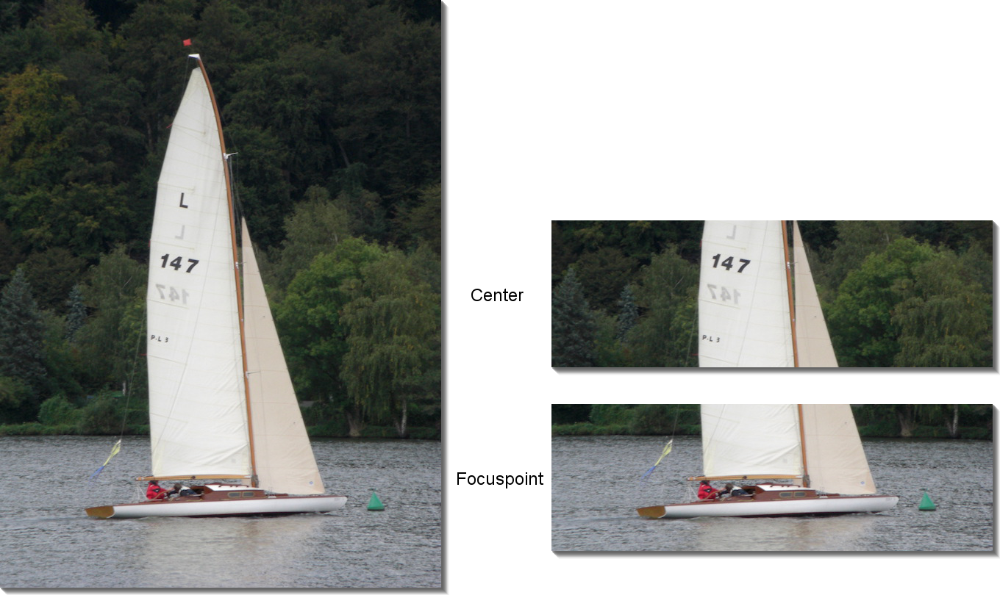
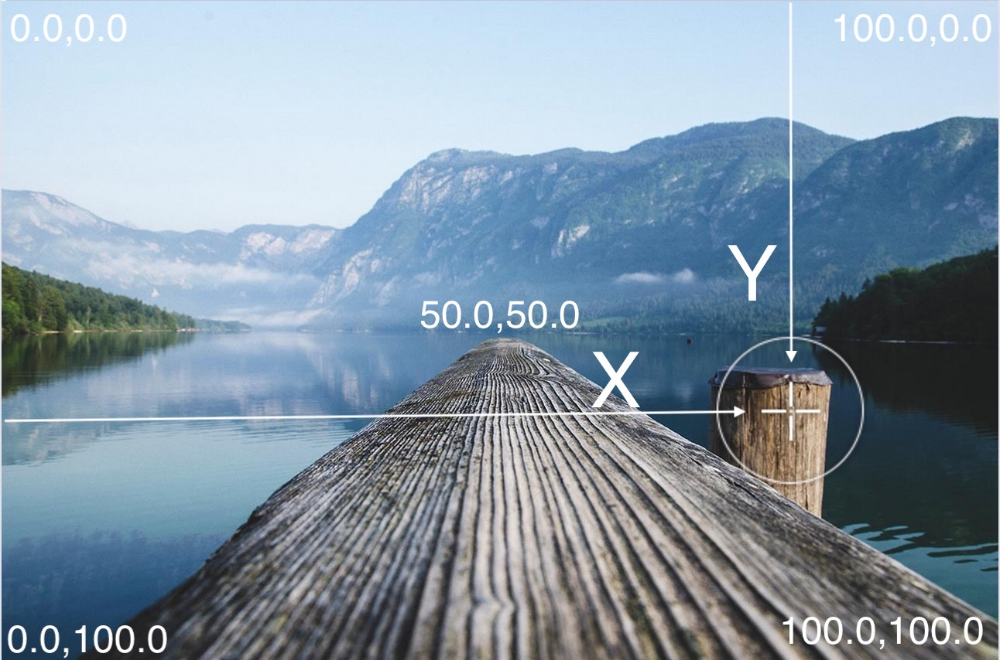
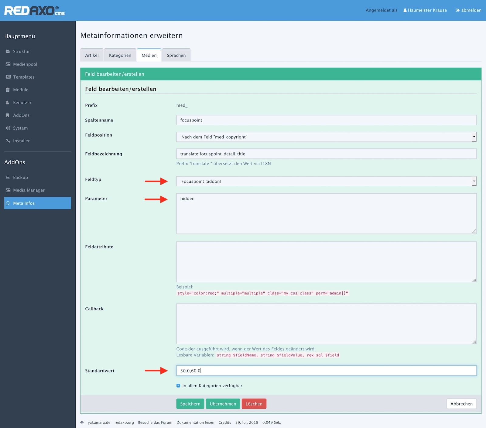

> - Grundlagen
> - [Bildern Fokuspunkte zuweisen](edit.md)
> - [Media-Manager: der Effekt "focuspoint-fit"](media_manager.md)
> - [Addon-Verwaltung](install.md)
> - [Hinweise für Entwickler (API)](developer.md)

# Grundlagen

## Fokuspunkt: Einführung

Die Mitte eines Bildes ist nicht oder nicht in jedem Fall auch der inhaltliche Mittelpunkt
eines Bildes. Wird ein Bild in unterschiedlichen Formaten, Zuschnitten und Zusammenhängen eingesetzt,
muss darauf geachtet werden, dass immer das Wesentliche bzw. Wichtigste zu sehen ist und
nicht Nebensächlichkeiten.



Beim automatischen Zuschnitt z.B. um die Bildmitte (Center) kann viel schiefgehen.

Besser wäre es, man könnte einem Bild Informationen mitgeben, wo der inhaltliche Mittelpunkt - _der
Fokuspunkt_ - des Bildes ist.

Das Fokuspoint-AddOn ist genau dafür entwickelt worden. Mit ihm können

- für einzelne Medien interaktiv festgelegt werden, wo der Bildschwerpunkt ist,
- Bilder unter Berücksichtigung des Fokuspunktes zugeschnitten werden,
- unabhängig vom Format des Quellbildes Layout-sichere Zielformate erzeugt werden,

Die [interaktive Festlegung](edit.md#mediapool) der Fokuspunkte wird im Medienpool vorgenommen.
Die Bildausgabe sollte über entsprechend konfigurierte [Bildtypen](media_manager.md#a) des
Media-Managers erfolgen.

<a name="coordinate"></a>
## Koordinaten

Koordinaten sind stets ein Wertepaar [x,y]; dabei steht
- x für die horizontale Position
- y für die vertikale Position

Koordinaten-Ursprung ist die Ecke oben links des Bildes. Der x-Wert bezieht sich auf den Abstand
vom linken Bildrand, der y-Wert ist der Abstand vom oberen Bildrand.



Die Koordinaten werden als prozentualer Anteil der Bildbreite bzw. Bildhöhe angegeben.

- '0.0,0.0': Ecke oben links
- '50.0,50.0' : Bildmitte
- '100.0,100.0' : Ecke unten rechts

Der ausgewählte Fokuspunkt im Beispielbild ist an der Position **'79.5,62.0'**.

In Eingabefeldern müssen Koordinaten immer mit einer Nachkommastelle eingegeben werden und dürfen
keine Leerzeichen enthalten. Für ungültige oder leere Felder wird der jeweiligen Default-Wert
(meist die Bildmitte, also '50.0,50.0') herangezogen.

Methoden und Funktionen erwarten oder liefern eine Koordinate als Array:

```php
$xy = [ 0 => «x», 1 => «y» ];
```

<a name="meta"></a>
## Meta-Datenfelder

**Fokuspunkte** beziehen sich immer auf Bilder. Andere Medien als Bilder werden nicht unterstützt.

Die Fokuspunkte (Koordinaten) werden in **Metafeldern zu Bildern** gespeichert. Eingegeben werden
Koordinaten in Medienpool, genauer gesagt in der Detailansicht eines Bildes.

Ein Metafeld für Fokuspunkte (`med_focuspoint`) wird automatisch mit der Installation bereitgestellt.
Es hat den Datentyp `Focuspoint (AddOn)`.

Es können beliebig weitere Metafelder für Fokuspunkte angelegt werden. Das AddOn erkennt und
berücksichtigt die Felder, die vom Typ `Focuspoint (AddOn)` sind.

Angelegt und konfiguriert werden Metafelder im Bereich "[Medien](?page=metainfo/media)"
der "Meta-Infos".



| Parameter | Hinweis |
| - | - |
| Feldtyp | "Focuspoint (AddOn)" auswählen, um Fokuspunktfelder festzulegen. |
| Parameter | Mit dem Text "hidden" wird das Fokuspunktfeld im Medienformular ausgeblendet. Das Feld kann weiterhin interaktiv befüllt werden. |
| Standardwert | Wenn für Medien in diesem Metafeld keine Koordinate erfasst ist, wird statt dessen der hier angegebene Wert herangezogen. Steht hier kein Wert, gilt die Bildmitte. |

Der Standardwert wird nicht automatisch für alle Felder herangezogen; er wird nur benutzt, wenn
ein Feld "zurückgesetzt" wird. Besser ist, einen Default-Wert im Effekt des Media-Managers einzustellen.

Es ist empfehlenswert, alle Fokuspunkt-Felder (sofern es mehrere gibt und sie sichtbar sind)
im Formular direkt hintereinander zu platzieren.


## Fokuspunkte festlegen

Die einfachste Variante der Eingabe ist die [interaktive Auswahl](edit.md#pointer) im Bild selbst. Man klickt einfach auf den
gewünschten Fokuspunkt, der in das [Eingabefeld](edit.md#input) übertragen wird.


## Bilder um den Fokuspunkt zentriert ausgeben

Bilder werden z.B. über [Typen im Media-Manager](media_manager.md) Fokuspunkt-bezogen erzeugt. Wie das
genau geht beschreibt die Dokumentation des [Media-Managers](?page=media_manager/overview/). Es ist also kein spezifisches
Ausgabemodul für Fokuspunkt-bezogene Bilder notwendig.

## Weitere Informationen

### [Neu in Version 2.0](changes_2_0.md)

### [Change-Log](../CHANGELOG.md)

### [MIT-Lizenz](../LICENSE.md)
